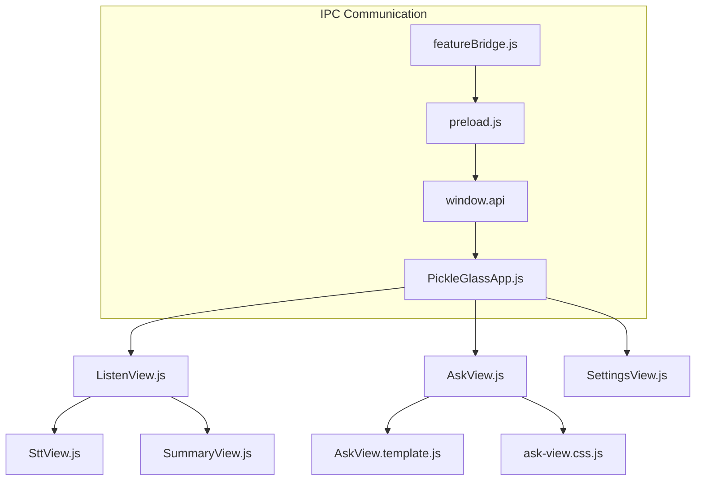
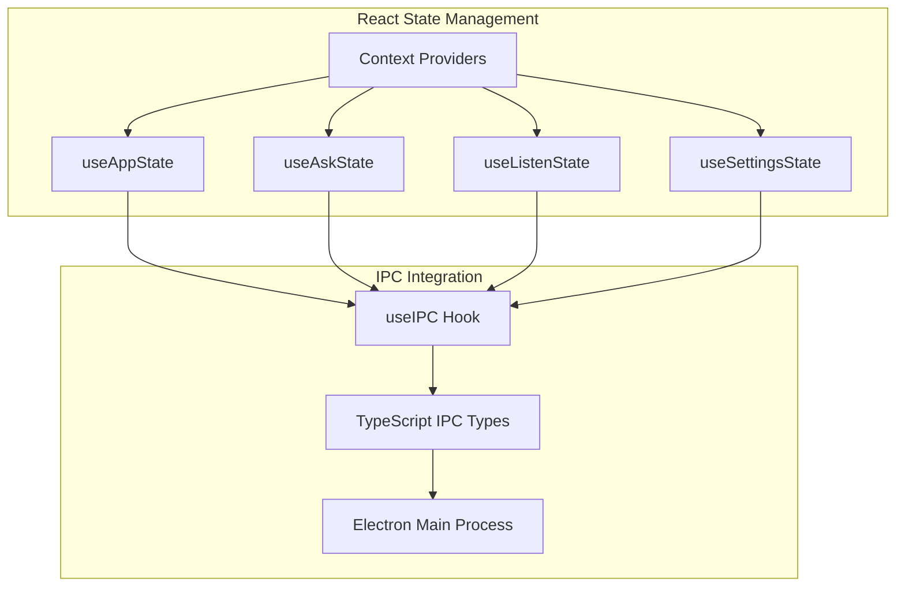
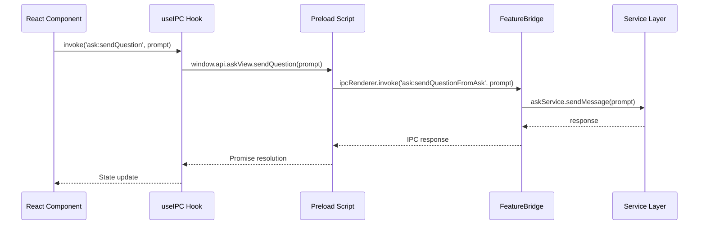

# WhisperV2 JavaScript to TypeScript/TSX/React Migration Design

## Overview

This design outlines the migration strategy for transforming the WhisperV2 `/src` folder from JavaScript with LitElement web components to TypeScript with React (TSX). The migration aims to modernize the UI layer while maintaining compatibility with the existing Electron architecture and IPC communication patterns.

**IMPORTANT SCOPE LIMITATION**: This migration applies ONLY to the `/src` folder. The `pickleglass_web` folder already uses Next.js + React + TypeScript and will remain completely untouched. Any references to "pickleglass_web" in this document are for architectural context only.

## Current Architecture Analysis

### Technology Stack Assessment

**Current Frontend Stack:**
- LitElement web components
- JavaScript ES6 modules
- CSS-in-JS using LitElement's `css` tagged template literals
- Direct DOM manipulation and custom event handling
- Lit-based reactive properties and lifecycle management

**Target Frontend Stack:**
- React 18+ with TypeScript
- TSX for component definitions
- Tailwind CSS for utility-first styling
- React hooks for state management
- Type-safe IPC communication

### Current Component Structure



## Component Architecture Migration Strategy

### 1. Component Hierarchy Transformation

**Before (LitElement):**
```javascript
export class AskView extends LitElement {
    static properties = {
        currentResponse: { type: String },
        isLoading: { type: Boolean }
    };
    
    render() {
        return html`<div>...</div>`;
    }
}
```

**After (React + TypeScript):**
```typescript
interface AskViewProps {
    onQuestionSubmit?: (question: string) => void;
}

interface AskViewState {
    currentResponse: string;
    isLoading: boolean;
}

export const AskView: React.FC<AskViewProps> = ({ onQuestionSubmit }) => {
    const [state, setState] = useState<AskViewState>({
        currentResponse: '',
        isLoading: false
    });
    
    return <div>...</div>;
};
```

### 2. Component Mapping Strategy

| Current LitElement Component | Target React Component | Migration Complexity |
|------------------------------|------------------------|---------------------|
| `PickleGlassApp` | `PickleGlassApp` | High - Root component with routing |
| `AskView` | `AskView` | High - Complex state management |
| `ListenView` | `ListenView` | High - Audio processing integration |
| `SettingsView` | `SettingsView` | Medium - Form state management |
| `SttView` | `SttView` | Medium - Real-time data display |
| `SummaryView` | `SummaryView` | Low - Display component |

### 3. State Management Architecture



## TypeScript Integration

### 1. Type Definitions Structure

```typescript
// src/types/ipc.types.ts
interface IPCEvents {
    'ask:sendQuestionFromAsk': (prompt: string) => Promise<void>;
    'ask:toggleAskButton': () => Promise<void>;
    'listen:changeSession': (text: string) => Promise<{ success: boolean }>;
    'model:validate-key': (params: { provider: string; key: string }) => Promise<boolean>;
}

// src/types/components.types.ts
interface AskViewState {
    currentResponse: string;
    currentQuestion: string;
    isLoading: boolean;
    isAnalyzing: boolean;
    isStreaming: boolean;
    showTextInput: boolean;
    showFollowupInput: boolean;
}

interface ListenViewState {
    isRecording: boolean;
    transcript: string;
    insights: string;
    sessionActive: boolean;
}

interface SettingsState {
    selectedProfile: string;
    selectedLanguage: string;
    apiKeys: Record<string, string>;
    modelSettings: ModelSettings;
}
```

### 2. IPC Communication Layer

```typescript
// src/hooks/useIPC.ts
import { useCallback, useEffect } from 'react';

interface IPCHook {
    invoke: <T extends keyof IPCEvents>(
        channel: T,
        ...args: Parameters<IPCEvents[T]>
    ) => ReturnType<IPCEvents[T]>;
    
    on: <T extends keyof IPCListeners>(
        channel: T,
        listener: IPCListeners[T]
    ) => () => void;
}

export const useIPC = (): IPCHook => {
    const invoke = useCallback(<T extends keyof IPCEvents>(
        channel: T,
        ...args: Parameters<IPCEvents[T]>
    ) => {
        if (!window.api) throw new Error('IPC not available');
        return (window.api as any)[channel.split(':')[0]]?.[channel.split(':')[1]]?.(...args);
    }, []);

    const on = useCallback(<T extends keyof IPCListeners>(
        channel: T,
        listener: IPCListeners[T]
    ) => {
        // Implementation for event listeners
        return () => {}; // Cleanup function
    }, []);

    return { invoke, on };
};
```

## Styling Migration Strategy

### 1. CSS-in-JS to Tailwind CSS Transformation

**Before (LitElement CSS):**
```javascript
// ask-view.css.js
export const styles = css`
    :host {
        display: block;
        width: 100%;
        height: 100%;
        color: white;
    }
    
    .ask-container {
        display: flex;
        flex-direction: column;
        background: rgba(11, 11, 11, 0.55);
        border-radius: 6px;
    }
`;
```

**After (Tailwind CSS):**
```typescript
// AskView.tsx
export const AskView: React.FC = () => {
    return (
        <div className="block w-full h-full text-white">
            <div className="flex flex-col bg-black/55 rounded-md">
                {/* Component content */}
            </div>
        </div>
    );
};
```

### 2. Tailwind Configuration for Electron

```javascript
// tailwind.config.js (for src folder)
module.exports = {
    content: [
        './src/**/*.{ts,tsx,js,jsx}',
        './src/**/*.html'
    ],
    theme: {
        extend: {
            colors: {
                'glass-bg': 'rgba(11, 11, 11, 0.55)',
                'glass-border': 'rgba(255, 255, 255, 0.25)',
                'glass-text': 'rgba(255, 255, 255, 0.9)',
            },
            backdropBlur: {
                'glass': '10px',
            },
            animation: {
                'slide-up': 'slideUp 0.3s cubic-bezier(0.4, 0, 0.6, 1) forwards',
                'slide-down': 'slideDown 0.35s cubic-bezier(0.34, 1.56, 0.64, 1) forwards',
                'pulse-text': 'pulseText 1.5s ease-in-out infinite',
            },
            keyframes: {
                slideUp: {
                    '0%': { opacity: '1', transform: 'translateY(0) scale(1)' },
                    '100%': { opacity: '0', transform: 'translateY(-150%) scale(0.85)' }
                },
                slideDown: {
                    '0%': { opacity: '0', transform: 'translateY(-150%) scale(0.85)' },
                    '100%': { opacity: '1', transform: 'translateY(0) scale(1)' }
                },
                pulseText: {
                    '0%, 100%': { opacity: '0.7' },
                    '50%': { opacity: '1' }
                }
            }
        },
    },
    plugins: [],
};
```

### 3. Animation and Transition Handling with Tailwind

```typescript
// src/hooks/useAnimation.ts
import { useEffect, useRef } from 'react';

export const useSlideAnimation = (visible: boolean) => {
    const elementRef = useRef<HTMLDivElement>(null);
    
    useEffect(() => {
        const element = elementRef.current;
        if (!element) return;
        
        if (visible) {
            element.classList.add('animate-slide-down');
            element.classList.remove('animate-slide-up', 'opacity-0', 'pointer-events-none');
        } else {
            element.classList.add('animate-slide-up');
            element.classList.remove('animate-slide-down');
            
            setTimeout(() => {
                element.classList.add('opacity-0', 'pointer-events-none');
                element.classList.remove('animate-slide-up');
            }, 300);
        }
    }, [visible]);
    
    return elementRef;
};
```

### 4. Tailwind Utility Classes for Glass Effect

```typescript
// Common glass effect utilities
const glassClasses = {
    container: 'bg-black/55 border border-white/25 rounded-md backdrop-blur-glass',
    header: 'bg-white/5 border-b border-white/10 backdrop-blur-sm',
    button: 'bg-white/10 hover:bg-white/15 border border-white/20 rounded transition-all duration-150',
    input: 'bg-black/40 border border-white/20 rounded text-white placeholder-white/50',
    text: {
        primary: 'text-white',
        secondary: 'text-white/70',
        muted: 'text-white/50'
    }
};

// Usage in components
export const AskView: React.FC = () => {
    return (
        <div className={`block w-full h-full ${glassClasses.text.primary}`}>
            <div className={glassClasses.container}>
                <div className={glassClasses.header}>
                    {/* Header content */}
                </div>
                {/* Rest of component */}
            </div>
        </div>
    );
};
### 5. Practical Component Conversion Example

**Before (LitElement with CSS-in-JS):**
```javascript
// AskView.js
import { styles } from './ask-view.css.js';

export class AskView extends LitElement {
    static styles = styles;
    
    render() {
        return html`
            <div class="ask-container">
                <div class="header-section">
                    <span class="header-text">AI Response</span>
                    <button class="copy-button" @click=${this.handleCopy}>
                        Copy
                    </button>
                </div>
                <div class="response-container">
                    ${this.currentResponse}
                </div>
            </div>
        `;
    }
}
```

**After (React with Tailwind):**
```typescript
// AskView.tsx
import React from 'react';
import { clsx } from 'clsx';

interface AskViewProps {
    currentResponse: string;
    onCopy: () => void;
}

export const AskView: React.FC<AskViewProps> = ({ 
    currentResponse, 
    onCopy 
}) => {
    return (
        <div className="flex flex-col bg-black/55 border border-white/25 rounded-md backdrop-blur-sm">
            <div className="flex justify-between items-center p-4 border-b border-white/10">
                <span className="text-white font-medium text-sm">
                    AI Response
                </span>
                <button 
                    onClick={onCopy}
                    className={clsx(
                        "px-3 py-1.5 text-xs rounded transition-all duration-150",
                        "bg-white/10 hover:bg-white/15 border border-white/20",
                        "text-white/80 hover:text-white"
                    )}
                >
                    Copy
                </button>
            </div>
            <div className="p-4 text-white/90 text-sm leading-relaxed">
                {currentResponse}
            </div>
        </div>
    );
};
```

### 1. Dependencies Installation

```bash
# Core React and TypeScript dependencies
npm install react react-dom @types/react @types/react-dom typescript

# Tailwind CSS and build tools
npm install -D tailwindcss autoprefixer postcss
npm install -D esbuild-plugin-postcss

# Additional utilities
npm install clsx classnames
```

### 2. Enhanced Build Configuration

```javascript
// Enhanced build.js for TypeScript support
const esbuild = require('esbuild');
const path = require('path');

const baseConfig = {
    bundle: true,
    platform: 'browser',
    format: 'esm',
    loader: { 
        '.ts': 'ts',
        '.tsx': 'tsx',
        '.js': 'jsx',
        '.css': 'css'
    },
    sourcemap: true,
    external: ['electron'],
    define: {
        'process.env.NODE_ENV': `"${process.env.NODE_ENV || 'development'}"`,
    },
    jsx: 'automatic',
    target: 'es2020',
};

const entryPoints = [
    { in: 'src/ui/app/HeaderController.tsx', out: 'public/build/header' },
    { in: 'src/ui/app/PickleGlassApp.tsx', out: 'public/build/content' },
];
```

### 2. TypeScript Configuration

```json
// tsconfig.json for src folder
{
    "compilerOptions": {
        "target": "ES2020",
        "lib": ["ES2020", "DOM", "DOM.Iterable"],
        "allowJs": true,
        "skipLibCheck": true,
        "esModuleInterop": true,
        "allowSyntheticDefaultImports": true,
        "strict": true,
        "forceConsistentCasingInFileNames": true,
        "moduleResolution": "node",
        "resolveJsonModule": true,
        "isolatedModules": true,
        "noEmit": true,
        "jsx": "react-jsx",
        "baseUrl": "./src",
        "paths": {
            "@/*": ["*"],
            "@/types/*": ["types/*"],
            "@/components/*": ["ui/components/*"],
            "@/hooks/*": ["hooks/*"]
        }
    },
    "include": [
        "src/**/*"
    ],
    "exclude": [
        "node_modules",
        "pickleglass_web"
    ]
}
```

## Critical Migration Challenges & Solutions

### 1. Template System Conversion

**Challenge**: Current components use separate template files (e.g., `AskView.template.js`) that need conversion to JSX.

**Current Pattern**:
```javascript
// AskView.template.js
export function renderTemplate(data) {
    return html`
        <div class="ask-container">
            ${data.currentResponse}
        </div>
    `;
}
```

**Target Pattern**:
```typescript
// AskView.tsx
interface TemplateProps {
    currentResponse: string;
}

const AskTemplate: React.FC<TemplateProps> = ({ currentResponse }) => {
    return (
        <div className="flex flex-col bg-black/55 rounded-md">
            {currentResponse}
        </div>
    );
};
```

**Solution Strategy**:
1. Create template conversion utility scripts
2. Map LitElement `html` tags to JSX
3. Convert CSS classes to Tailwind utilities
4. Preserve component logic separation

### 2. Audio Processing Integration

**Critical Requirement**: The `/src/ui/listen/audioCore/` components must maintain real-time performance (<100ms latency).

**Audio Components to Integrate**:
```
src/ui/listen/audioCore/
├── aec.js          // Audio Echo Cancellation (Rust-based)
├── listenCapture.js // Real-time audio capture
└── renderer.js     // Audio rendering pipeline
```

**Integration Strategy**:
```typescript
// useAudioCore.ts
import { useEffect, useRef } from 'react';

export const useAudioCore = () => {
    const aecRef = useRef(null);
    const captureRef = useRef(null);
    
    useEffect(() => {
        // Initialize native audio components
        // Maintain existing performance characteristics
        import('../listen/audioCore/aec.js').then(aec => {
            aecRef.current = aec;
        });
        
        return () => {
            // Cleanup audio resources
        };
    }, []);
    
    return { aecRef, captureRef };
};
```

### 3. SMD.js Streaming Integration

**Challenge**: Current `AskView` uses complex streaming with SMD.js markdown parser.

**Current Implementation**:
```javascript
// Complex streaming state in AskView.js
this.smdParser = parser();
this.smdContainer = null;
this.lastProcessedLength = 0;
this.wordCount = 0;
```

**React Integration Strategy**:
```typescript
// useStreamingMarkdown.ts
import { useState, useRef, useCallback } from 'react';
import { parser, parser_write, parser_end } from '../assets/smd.js';

export const useStreamingMarkdown = () => {
    const [content, setContent] = useState('');
    const parserRef = useRef(parser());
    const lastProcessedRef = useRef(0);
    
    const processChunk = useCallback((chunk: string) => {
        // Maintain SMD.js compatibility
        parser_write(parserRef.current, chunk);
        // Update React state efficiently
    }, []);
    
    return { content, processChunk };
};
```

### 4. Electron Window Management

**Challenge**: Maintain glass effects and dynamic window resizing.

**Current System**:
```javascript
// Complex window management with transparency
const params = new URLSearchParams(window.location.search);
if (params.get('glass') === 'true') {
    document.body.classList.add('has-glass');
}
```

**React Solution**:
```typescript
// useElectronWindow.ts
export const useElectronWindow = () => {
    const [hasGlass, setHasGlass] = useState(false);
    
    useEffect(() => {
        const urlParams = new URLSearchParams(window.location.search);
        setHasGlass(urlParams.get('glass') === 'true');
    }, []);
    
    return { hasGlass };
};
```

## Enhanced Migration Implementation Phases

### Phase 0: Pre-Migration Setup (NEW - Week 1)
1. **Dual Build System**: Configure esbuild to handle both `.js` and `.tsx` files
2. **Feature Flags**: Implement component-by-component migration flags
3. **Template Conversion Tools**: Create utilities to convert LitElement templates
4. **Audio Integration Planning**: Analyze native audio components
5. **Compatibility Layer**: Set up LitElement-React bridge

### Phase 1: Foundation Setup (Week 2)
1. Install TypeScript, React, and Tailwind CSS dependencies for `/src` only
2. Configure separate tsconfig.json for `/src` (distinct from pickleglass_web)
3. Create type definitions for existing IPC interfaces
4. Set up Tailwind CSS configuration with glass effect utilities
5. Create base React component structure

### Phase 2: Core Component Migration (Week 3-4)
1. Migrate `PickleGlassApp` root component with routing
2. Transform IPC communication layer to typed hooks
3. **Convert `AskView.template.js` to JSX components**
4. Migrate `AskView` with streaming markdown support
5. Implement SMD.js React integration

### Phase 3: Audio Integration (Week 5 - CRITICAL)
1. **Integrate `/src/ui/listen/audioCore/` with React lifecycle**
2. **Ensure AEC performance requirements (<100ms latency)**
3. **Validate real-time audio processing compatibility**
4. Create React hooks for audio components
5. Performance testing and optimization

### Phase 4: Feature Components (Week 6-7)
1. Migrate `ListenView` with audio core integration
2. Transform `SettingsView` with form handling
3. Convert `SttView` and `SummaryView`
4. Implement React-based animation system following UI specifications
5. Convert all remaining template files

### Phase 5: Integration & Testing (Week 8)
1. Integration testing with Electron main process
2. Audio latency and performance validation
3. End-to-end testing of streaming functionality
4. Memory leak prevention and optimization
5. Documentation and code cleanup

## Data Flow Architecture



## Error Handling & Performance

### 1. Error Boundary Implementation

```typescript
// src/components/ErrorBoundary.tsx
interface ErrorBoundaryState {
    hasError: boolean;
    error?: Error;
}

export class ErrorBoundary extends React.Component<
    React.PropsWithChildren<{}>,
    ErrorBoundaryState
> {
    constructor(props: React.PropsWithChildren<{}>) {
        super(props);
        this.state = { hasError: false };
    }

    static getDerivedStateFromError(error: Error): ErrorBoundaryState {
        return { hasError: true, error };
    }

    componentDidCatch(error: Error, errorInfo: React.ErrorInfo) {
        console.error('UI Error:', error, errorInfo);
        // Send to error reporting service
    }

    render() {
        if (this.state.hasError) {
            return <div>Something went wrong. Please restart the application.</div>;
        }

        return this.props.children;
    }
}
```

### 2. Performance Optimization

```typescript
// src/hooks/useMemoryOptimization.ts
export const useMemoryOptimization = () => {
    useEffect(() => {
        return () => {
            // Cleanup IPC listeners
            // Clear intervals/timeouts
            // Remove event listeners
        };
    }, []);
};

// Memoization for expensive components
export const AskView = React.memo<AskViewProps>(({ onQuestionSubmit }) => {
    // Component implementation
}, (prevProps, nextProps) => {
    // Custom comparison logic
    return prevProps.onQuestionSubmit === nextProps.onQuestionSubmit;
});
```

## Testing Strategy

### 1. Unit Testing Framework

```typescript
// src/__tests__/AskView.test.tsx
import { render, screen, fireEvent, waitFor } from '@testing-library/react';
import { AskView } from '../ui/ask/AskView';

// Mock IPC
const mockIPC = {
    invoke: jest.fn(),
    on: jest.fn(() => () => {})
};

jest.mock('../hooks/useIPC', () => ({
    useIPC: () => mockIPC
}));

describe('AskView', () => {
    test('submits question through IPC', async () => {
        render(<AskView />);
        
        const input = screen.getByPlaceholderText('Ask anything...');
        fireEvent.change(input, { target: { value: 'Test question' } });
        fireEvent.keyDown(input, { key: 'Enter' });
        
        await waitFor(() => {
            expect(mockIPC.invoke).toHaveBeenCalledWith(
                'ask:sendQuestionFromAsk',
                'Test question'
            );
        });
    });
});
```

## Enhanced Build System Configuration

### Updated build.js for Mixed Codebase

```javascript
// Enhanced build.js for /src migration
const esbuild = require('esbuild');
const path = require('path');

const baseConfig = {
    bundle: true,
    platform: 'browser',
    format: 'esm',
    loader: { 
        '.js': 'jsx',     // Current LitElement files
        '.ts': 'ts',      // New TypeScript files
        '.tsx': 'tsx',    // New React components
        '.css': 'css'     // CSS imports for Tailwind
    },
    plugins: [
        // PostCSS plugin for Tailwind (REQUIRED)
        require('esbuild-plugin-postcss')({
            plugins: [require('tailwindcss'), require('autoprefixer')]
        })
    ],
    sourcemap: true,
    external: ['electron'],
    define: {
        'process.env.NODE_ENV': `"${process.env.NODE_ENV || 'development'}"`,
    },
    jsx: 'automatic',
    target: 'es2020',
};

// Support both legacy and new entry points
const entryPoints = [
    { in: 'src/ui/app/HeaderController.js', out: 'public/build/header' },
    { in: 'src/ui/app/PickleGlassApp.js', out: 'public/build/content' },
    // Future React entry points
    // { in: 'src/ui/app/PickleGlassApp.tsx', out: 'public/build/content-react' },
];
```

### Separate TypeScript Configuration

```json
// tsconfig.json for /src folder (NEW FILE)
{
    "compilerOptions": {
        "target": "ES2020",
        "lib": ["ES2020", "DOM", "DOM.Iterable"],
        "allowJs": true,
        "skipLibCheck": true,
        "esModuleInterop": true,
        "allowSyntheticDefaultImports": true,
        "strict": true,
        "forceConsistentCasingInFileNames": true,
        "moduleResolution": "node",
        "resolveJsonModule": true,
        "isolatedModules": true,
        "noEmit": true,
        "jsx": "react-jsx",
        "baseUrl": "./src",
        "paths": {
            "@/*": ["*"],
            "@/types/*": ["types/*"],
            "@/components/*": ["ui/components/*"],
            "@/hooks/*": ["hooks/*"]
        }
    },
    "include": [
        "src/**/*"
    ],
    "exclude": [
        "node_modules",
        "pickleglass_web"  // EXPLICITLY EXCLUDE
    ]
}
```

## Risk Assessment & Mitigation

### Critical Risk Areas

1. **Audio Processing Performance**
   - **Risk**: Breaking real-time audio processing (<100ms latency requirement)
   - **Mitigation**: Maintain native audio core components, integrate via React hooks
   - **Validation**: Continuous latency monitoring during migration

2. **SMD.js Streaming Compatibility**
   - **Risk**: Breaking word-by-word streaming in React state updates
   - **Mitigation**: Preserve SMD.js parser state, use efficient React state updates
   - **Validation**: Streaming performance tests

3. **Template System Conversion**
   - **Risk**: Logic errors during LitElement template to JSX conversion
   - **Mitigation**: Automated conversion tools + manual validation
   - **Validation**: Visual regression testing

4. **IPC Communication Compatibility**
   - **Risk**: Breaking existing communication with main process
   - **Mitigation**: Maintain existing IPC interface, gradual migration
   - **Validation**: Integration tests for all IPC channels

5. **Performance Regression**
   - **Risk**: React overhead compared to LitElement
   - **Mitigation**: React.memo, useMemo, lazy loading, proper component optimization
   - **Validation**: Performance benchmarks

6. **Animation System Disruption**
   - **Risk**: Loss of smooth animations during migration
   - **Mitigation**: CSS-based animations with React hooks, follow UI specifications
   - **Validation**: Animation performance testing

7. **Electron Glass Effects**
   - **Risk**: Breaking transparency and glass effects
   - **Mitigation**: Preserve existing window management, integrate with React
   - **Validation**: Visual testing on target platforms

## Dependencies Installation (src-only)

```bash
# Core React and TypeScript dependencies for /src
npm install react react-dom @types/react @types/react-dom typescript

# Tailwind CSS and build tools
npm install -D tailwindcss autoprefixer postcss
npm install -D esbuild-plugin-postcss

# React Icons for UI consistency
npm install lucide-react

# Additional utilities
npm install clsx classnames

# Type definitions for Electron (if not present)
npm install -D @types/electron
```

**Note**: These dependencies are for the `/src` migration only. The `pickleglass_web` folder dependencies remain untouched.

## Enhanced Migration Validation Criteria

### Functional Requirements
- [ ] All existing functionality preserved
- [ ] IPC communication maintains exact compatibility
- [ ] Template system conversion accuracy (100%)
- [ ] SMD.js streaming performance maintained
- [ ] Audio processing latency <100ms preserved
- [ ] Electron glass effects and transparency working

### Performance Requirements
- [ ] No performance degradation in UI responsiveness
- [ ] Audio processing real-time performance maintained
- [ ] Streaming markdown rendering performance preserved
- [ ] Memory usage optimization (no leaks)
- [ ] Animation smoothness (60fps) maintained

### Technical Requirements
- [ ] Type safety across all IPC communications
- [ ] Proper error handling and user feedback
- [ ] Consistent visual appearance and animations
- [ ] Build system handles mixed .js/.tsx files
- [ ] Hot reload functionality preserved

### Integration Requirements
- [ ] Native audio components integration successful
- [ ] Window management and resizing working
- [ ] Keyboard shortcuts functionality preserved
- [ ] Cross-platform compatibility (macOS, Windows)

## Final Implementation Notes

1. **Scope Reminder**: This migration affects ONLY the `/src` folder. The `pickleglass_web` folder uses Next.js + React + TypeScript and remains completely unchanged.

2. **Gradual Migration**: Follow the gradual component-by-component approach with feature flags to minimize risk.

3. **Audio Processing Priority**: Audio integration is the highest risk component and requires careful testing.

4. **Template Conversion**: Create automated tools for LitElement template to JSX conversion to minimize errors.

5. **Performance Monitoring**: Implement continuous performance monitoring during migration, especially for audio processing and streaming components.