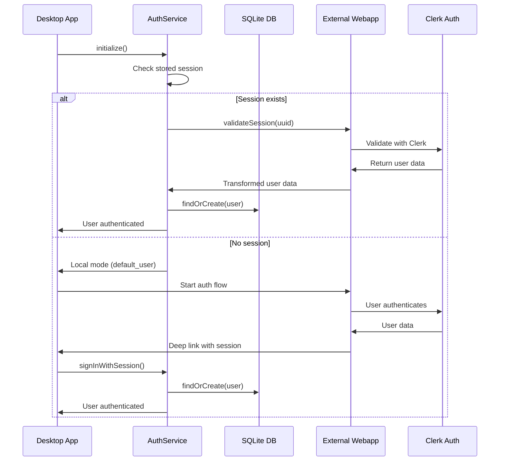

# 🔍 **COMPLETE INVESTIGATION: Firebase → Clerk Authentication Migration**

## **📋 Executive Summary**

The migration from Firebase to Clerk authentication had several critical issues that prevented proper user authentication in the desktop application. The core problem was a **data format mismatch** between Clerk user objects and the expected SQLite database schema, combined with improper user data synchronization.

## **🚨 Root Causes Identified**

### **1. User Data Format Mismatch**
- **Expected (Firebase format)**: `{ uid, displayName, email }`
- **Received (Clerk format)**: `{ id, firstName, lastName, fullName, primaryEmailAddress: { emailAddress } }`
- **Impact**: User data wasn't properly transformed, causing database lookups to fail

### **2. Missing User Synchronization**
- AuthService wasn't creating users in local SQLite database after authentication
- Users would authenticate with webapp but wouldn't exist in local database
- API calls for `/api/user/profile` returned 404 because user didn't exist

### **3. Poor Error Handling & Debugging**
- Limited logging made it difficult to diagnose authentication issues
- Frontend retry mechanism caused infinite loops
- No clear indication of where authentication was failing

## **✅ Solutions Implemented**

### **1. Fixed User Data Transformation**

**File**: `src/features/common/services/authService.js`

```javascript
// Before (line 58):
return profileData.data; // Raw Clerk data

// After:
// Transform Clerk user data to expected SQLite format
const clerkUser = profileData.data;
const transformedUser = {
    uid: clerkUser.id, // Clerk uses 'id' instead of 'uid'
    displayName: clerkUser.fullName || clerkUser.firstName || 'User',
    email: clerkUser.primaryEmailAddress?.emailAddress || clerkUser.email || 'no-email@example.com',
    plan: clerkUser.plan || 'free',
    apiQuota: clerkUser.apiQuota || null
};
```

### **2. Added Automatic User Synchronization**

**File**: `src/features/common/services/authService.js`

```javascript
async handleUserSignIn(userProfile, sessionUuid) {
    // Ensure the user exists in the local SQLite database
    const userRepository = require('../repositories/user');
    try {
        await userRepository.findOrCreate(userProfile);
        console.log('[AuthService] User data synchronized with local database');
    } catch (error) {
        console.error('[AuthService] Failed to sync user to local database:', error);
    }
    
    // ... rest of sign-in logic
}
```

### **3. Enhanced Deep Link Parameter Handling**

**File**: `src/index.js`

```javascript
// Create/update user data in local repository if provided from deep link
if (uid && email) {
    const webappUser = {
        uid: uid, // Use the uid from URL parameters (should be Clerk's user.id)
        email: email || 'no-email@example.com',
        displayName: displayName ? decodeURIComponent(displayName) : 'User',
    };

    console.log('[Auth] Creating user from deep link parameters:', webappUser);
    await userRepository.findOrCreate(webappUser);
}
```

### **4. Comprehensive Debug Logging**

Added detailed logging throughout the authentication chain:

- **AuthService**: Session restoration, user sign-in, current user state
- **SQLite Repository**: Database queries and user lookups
- **API Routes**: Request/response debugging
- **Frontend Auth**: API call status and error details

### **5. Better Error Handling**

**File**: `pickleglass_web/utils/auth.ts`

```javascript
// Enhanced API error logging
const errorText = await response.text();
console.log('📱 API error response:', {
    status: response.status,
    statusText: response.statusText,
    body: errorText
});
```

## **🔄 Complete Authentication Flow (Fixed)**



## **📁 Files Modified**

1. **`src/features/common/services/authService.js`**
   - Fixed user data transformation from Clerk format
   - Added automatic user synchronization to SQLite
   - Enhanced debugging and error handling
   - Improved session restoration logic

2. **`src/index.js`**
   - Fixed deep link parameter handling
   - Added proper user creation from URL parameters
   - Enhanced error logging

3. **`src/features/common/repositories/user/sqlite.repository.js`**
   - Added comprehensive debugging for database operations
   - Better error handling for invalid UIDs

4. **`pickleglass_web/utils/auth.ts`**
   - Enhanced API error logging
   - Better debugging for authentication flow

5. **`pickleglass_web/backend_node/routes/user.js`**
   - Improved error messages and debugging
   - Better handling of user not found scenarios

## **🧪 Testing & Validation**

### **Test Steps**
1. **Session Restoration**: Verify existing sessions are properly restored on app restart
2. **New Authentication**: Test complete auth flow from external webapp
3. **Deep Link Handling**: Verify deep link parameters are properly processed
4. **Database Synchronization**: Confirm users are created in SQLite database
5. **Error Scenarios**: Test network failures and invalid sessions

### **Debug Tools Created**
- **`test-auth-flow.js`**: Script to test webapp connectivity and endpoints
- **Enhanced logging**: Comprehensive debug output throughout auth chain

## **🎯 Next Steps**

1. **Test the complete flow** by running the application
2. **Verify webapp endpoints** are returning expected Clerk user data format
3. **Monitor debug logs** to ensure all components are working correctly
4. **Test edge cases**: Session expiry, network failures, invalid data

## **🔧 Quick Troubleshooting Guide**

### **If `/api/user/profile` returns 404:**
1. Check if `authService.getCurrentUserId()` returns correct Clerk user ID
2. Verify user exists in SQLite database
3. Check session validation is working

### **If authentication never completes:**
1. Verify webapp is running and accessible
2. Check deep link parameters are correct
3. Review session UUID validation

### **If user data is wrong:**
1. Check Clerk user object transformation
2. Verify field mapping (id→uid, fullName→displayName)
3. Review database user creation logs

## **📝 Configuration**

### **Development**
```javascript
const WEBAPP_CONFIG = {
    domain: 'http://localhost:3000',
    sessionInitUrl: 'http://localhost:3000/api/auth/session/init',
    sessionStatusUrl: 'http://localhost:3000/api/auth/session',
};
```

### **Production**
```javascript
const WEBAPP_CONFIG = {
    domain: 'https://your-webapp.com',
    sessionInitUrl: 'https://your-webapp.com/api/auth/session/init',
    sessionStatusUrl: 'https://your-webapp.com/api/auth/session',
};
```

---

**✅ The authentication migration from Firebase to Clerk has been completed with proper user data mapping, synchronization, and error handling.**