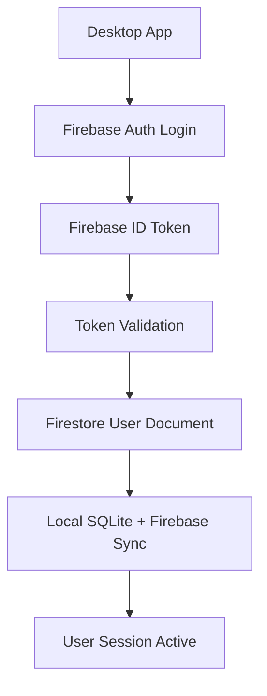
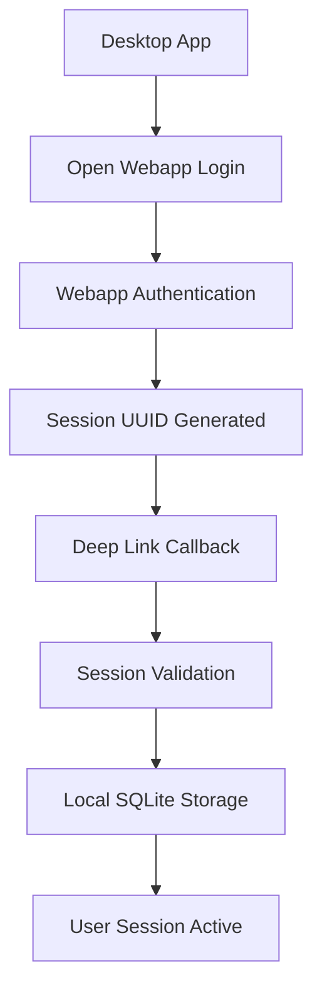
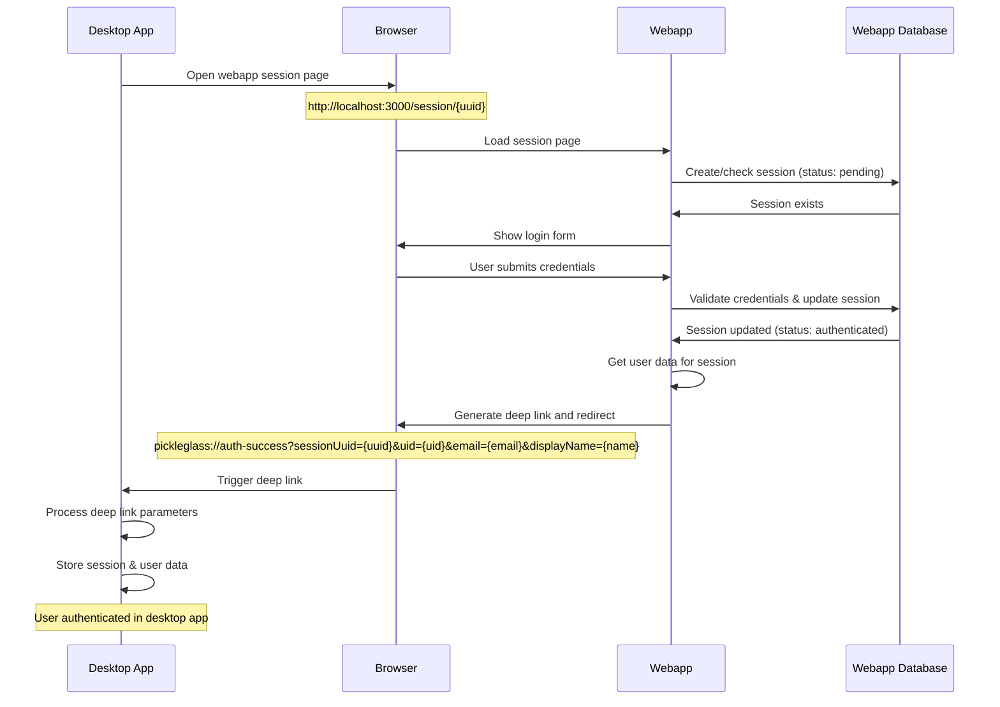

# WhisperV2 Authentication Migration Documentation

## Table of Contents

1. [Overview](#overview)
2. [Previous Firebase Architecture](#previous-firebase-architecture)
3. [New Webapp Authentication Architecture](#new-webapp-authentication-architecture)
4. [Migration Changes](#migration-changes)
5. [Current State and Requirements](#current-state-and-requirements)
6. [Webapp Integration Requirements](#webapp-integration-requirements)
7. [Deep Link Authentication Flow](#deep-link-authentication-flow)
8. [API Endpoints Required](#api-endpoints-required)
9. [Error Handling](#error-handling)
10. [Testing and Validation](#testing-and-validation)

## Overview

This document outlines the complete migration of WhisperV2's authentication system from Firebase-based authentication to a webapp-based session authentication system. The migration was undertaken to consolidate authentication under the main webapp infrastructure at `https://app-whisper.com`, eliminate Firebase dependencies, and implement a local-first data strategy.

### Migration Goals

- **Remove Firebase Dependencies**: Complete elimination of Firebase authentication, Firestore, and cloud functions
- **Webapp Integration**: Leverage existing webapp authentication infrastructure
- **Local-First Strategy**: Use SQLite for all data storage with webapp providing authentication only
- **Deep Link Protocol**: Maintain existing `pickleglass://` protocol for seamless desktop integration
- **Session-Based Auth**: Use UUID-based sessions with 7-day expiry from webapp backend

## Previous Firebase Architecture

### What We Had Before

#### Authentication Flow



#### Key Components

1. **Firebase Authentication**
    - Email/password login
    - Google OAuth integration
    - JWT tokens for session management
    - Cloud function callbacks

2. **Firebase Firestore**
    - User profiles and settings
    - Session data synchronization
    - Cross-device data sync
    - Encrypted data storage

3. **Firebase Cloud Functions**
    - Authentication callbacks
    - Data validation and processing
    - Custom token generation
    - Deep link token exchange

#### File Structure (Previous)

```
src/features/common/services/
├── firebaseClient.js          # Firebase SDK initialization
├── authService.js             # Firebase auth integration
└── migrationService.js        # Firebase data migration

pickleglass_web/utils/
├── firebase.ts                # Firebase config and auth
├── api.ts                     # Firebase/local API switching
└── auth.ts                    # Firebase auth state management

Configuration Files:
├── firebase.json              # Firebase project config
├── firestore.indexes.json     # Firestore query indexes
└── functions/                 # Cloud functions directory
```

#### Authentication Service Methods

```javascript
// Previous Firebase methods
-signInWithEmailAndPassword() - signInWithGoogle() - onAuthStateChanged() - getIdToken() - signOut() - createUserWithEmailAndPassword();
```

#### Data Flow Pattern

1. User logs in via Firebase Auth
2. Firebase returns JWT ID token
3. Token used for Firestore access
4. Data synced between Firestore and local SQLite
5. Repository pattern switched between Firebase/SQLite based on auth state

## New Webapp Authentication Architecture

### What We Changed To

#### Authentication Flow



#### Key Components

1. **Webapp Authentication**
    - Hosted at `https://app-whisper.com` (production) / `http://localhost:3000` (development)
    - Session-based authentication with UUID tokens
    - 7-day session expiry
    - User profile management

2. **Deep Link Integration**
    - `pickleglass://auth-success` protocol
    - Session UUID and user data transmission
    - Seamless desktop app integration

3. **Local-First Data Strategy**
    - SQLite for all data storage
    - No cloud synchronization
    - Webapp provides authentication only

#### File Structure (Current)

```
src/features/common/services/
├── authService.js             # Webapp session authentication
└── migrationService.js        # Disabled placeholder

pickleglass_web/utils/
├── api.ts                     # Local-only API calls
└── auth.ts                    # localStorage-based auth

Removed Files:
├── firebase.json              # ❌ Deleted
├── firestore.indexes.json     # ❌ Deleted
├── functions/                 # ❌ Deleted
└── firebase-related imports   # ❌ Removed
```

#### Authentication Service Methods

```javascript
// New webapp methods
-startWebappAuthFlow() - signInWithSession(sessionUuid, userInfo) - validateSession(sessionUuid) - signOut() - refreshUserProfile();
```

## Migration Changes

### Files Modified

#### 1. Core Authentication Service (`src/features/common/services/authService.js`)

**Before:**

```javascript
// Firebase-based authentication
const { signInWithEmailAndPassword, onAuthStateChanged } = require('firebase/auth');
const { getFirestoreInstance } = require('./firebaseClient');

// Firebase auth state management
onAuthStateChanged(auth, user => {
    if (user) {
        // Handle Firebase user
        this.handleFirebaseUser(user);
    }
});
```

**After:**

```javascript
// Webapp session authentication
const WEBAPP_CONFIG = {
    domain: 'http://localhost:3000', // Development
    loginUrl: 'http://localhost:3000/auth/sign-in?mode=electron',
    userProfileUrl: 'http://localhost:3000/api/auth/user-by-session',
};

async function validateSession(sessionUuid) {
    const response = await fetch(`${WEBAPP_CONFIG.userProfileUrl}/${sessionUuid}`);
    const data = await response.json();
    return data.data; // User profile
}
```

#### 2. Deep Link Handler (`src/index.js`)

**Before:**

```javascript
// Firebase token exchange
if (params.token) {
    await authService.signInWithCustomToken(params.token);
}
```

**After:**

```javascript
// Session UUID validation
async function handleWebappAuthCallback(params) {
    const { sessionUuid, uid, email, displayName } = params;
    await authService.signInWithSession(sessionUuid, { uid, email, displayName });
}
```

#### 3. Web Frontend Login (`pickleglass_web/app/login/page.tsx`)

**Before:**

```javascript
// Firebase authentication UI
import { signInWithEmailAndPassword } from 'firebase/auth';

const handleFirebaseLogin = async () => {
    await signInWithEmailAndPassword(auth, email, password);
};
```

**After:**

```javascript
// Webapp redirect authentication
const handleWebappSignIn = async () => {
    window.location.href = 'http://localhost:3000/auth/sign-in?mode=electron';
};
```

#### 4. API Layer (`pickleglass_web/utils/api.ts`)

**Before:**

```javascript
// Firebase/local mode switching
const isFirebaseMode = (): boolean => {
    return !!getCurrentUser();
};

if (isFirebaseMode()) {
    // Use Firestore
    return await firebaseRepository.getData();
} else {
    // Use local API
    return await apiCall('/api/data');
}
```

**After:**

```javascript
// Local-only API calls
const isFirebaseMode = (): boolean => {
    return false; // Always use local-first approach
};

// All operations use local API
return await apiCall('/api/data');
```

#### 5. Repository Adapters

**All repository files updated:**

- `src/features/ask/repositories/index.js`
- `src/features/common/repositories/user/index.js`
- `src/features/common/repositories/session/index.js`
- `src/features/common/repositories/preset/index.js`
- `src/features/settings/repositories/index.js`
- `src/features/listen/stt/repositories/index.js`
- `src/features/listen/summary/repositories/index.js`

**Before:**

```javascript
const firebaseRepository = require('./firebase.repository');

function getBaseRepository() {
    const user = authService.getCurrentUser();
    if (user && user.isLoggedIn) {
        return firebaseRepository;
    }
    return sqliteRepository;
}
```

**After:**

```javascript
// Firebase import removed

function getBaseRepository() {
    // Always use SQLite for local-first data strategy
    return sqliteRepository;
}
```

### Dependencies Removed

```json
// Removed from package.json
{
    "firebase": "^11.10.0",
    "@firebase/app": "^x.x.x",
    "@firebase/auth": "^x.x.x",
    "@firebase/firestore": "^x.x.x"
}
```

### Configuration Files Deleted

- `firebase.json` - Firebase project configuration
- `firestore.indexes.json` - Firestore database indexes
- `functions/` - Firebase cloud functions directory

## Current State and Requirements

### Actual Current Webapp System

✅ **What Already Exists:**

- Session-based authentication system at `/session/{uuid}`
- API endpoint `/api/auth/session/{uuid}` for session status checking
- Session states: `pending` → `authenticated`
- User sync endpoint `/api/auth/sync`
- LLM consumption endpoint `/api/llm/consume`

✅ **Desktop App Completed:**

- Firebase dependencies completely removed
- All repository adapters use SQLite exclusively
- Authentication service rewritten for webapp integration
- Build process cleaned of Firebase references

⚠️ **Current Issues:**

- Deep link authentication approach not working properly
- Next.js header iteration errors in webapp
- Desktop app trying to open webapp login URL instead of working with existing session system
- Need to modify desktop app to work with existing session polling system

### Data Storage Strategy

- **Local SQLite**: All user data (sessions, presets, transcripts, summaries)
- **Webapp Backend**: Authentication and user profiles only
- **No Cloud Sync**: Data remains on user's device
- **Session Management**: 7-day UUID sessions from webapp

## Webapp Integration Requirements

### Revised Approach: Session Polling Instead of Deep Links

Based on the existing webapp system, we should abandon the deep link approach and use session polling instead:

#### 1. Existing Webapp System (Already Implemented)

##### Session Status Endpoint

**URL:** `GET /api/auth/session/{uuid}`

**Current Responses:**

```json
// Session pending (user hasn't logged in yet)
{
  "status": "pending"
}

// Session authenticated (user logged in)
{
  "status": "authenticated",
  // Additional user data
}
```

##### Session Page

**URL:** `/session/{uuid}`

- Displays login form or authentication status
- User authenticates directly on this page
- No need for deep links or redirects

### What the Webapp Needs to Add

The webapp already has the session system working. You just need to add **deep link generation** after successful authentication:

#### Session Page Modification

**File:** `/session/{uuid}` page component

**Add after successful authentication:**

```javascript
// After user authenticates successfully
if (authenticationSuccessful) {
    // Get user data
    const userData = {
        sessionUuid: session.uuid,
        uid: user.uid,
        email: user.email,
        displayName: encodeURIComponent(user.displayName || user.name),
    };

    // Generate deep link
    const deepLink = `pickleglass://auth-success?sessionUuid=${userData.sessionUuid}&uid=${userData.uid}&email=${userData.email}&displayName=${userData.displayName}`;

    // Redirect to deep link
    window.location.href = deepLink;
}
```

#### Current Session Status API (Keep As Is)

**Endpoint:** `GET /api/auth/session/{sessionUuid}`

This is already working and doesn't need changes. The desktop app can still use this for session validation.

#### 2. Session Management

**Requirements:**

- Generate UUID-based session tokens
- 7-day expiry period
- Secure session storage in webapp database
- Session validation without requiring full authentication

**Session Schema:**

```sql
CREATE TABLE user_sessions (
    session_uuid VARCHAR(36) PRIMARY KEY,
    user_id VARCHAR(255) NOT NULL,
    created_at TIMESTAMP DEFAULT CURRENT_TIMESTAMP,
    expires_at TIMESTAMP NOT NULL,
    last_used TIMESTAMP DEFAULT CURRENT_TIMESTAMP,
    device_info TEXT,
    FOREIGN KEY (user_id) REFERENCES users(uid)
);
```

#### 3. User Profile Management

**Expected User Schema:**

```json
{
    "uid": "string", // Unique user identifier
    "email": "string", // User email address
    "displayName": "string", // User display name
    "plan": "string", // Subscription plan (free, pro, enterprise)
    "apiQuota": {
        "daily": "number", // Daily API call limit
        "used": "number", // API calls used today
        "remaining": "number" // Remaining API calls
    }
}
```

## Revised Authentication Flow: Webapp Deep Link Generation

### Complete Flow Diagram



### Key Points

- **Desktop app**: No changes needed, deep link handler already works
- **Webapp**: Needs to generate deep link after successful authentication
- **Session UUID**: Already generated and working in webapp
- **User data**: Available in webapp after authentication

## API Endpoints Required

### 1. Authentication Endpoints

#### GET `/auth/sign-in`

**Purpose:** Login page with Electron mode detection
**Query Parameters:**

- `mode=electron` (optional): Indicates login from desktop app

#### POST `/auth/sign-in`

**Purpose:** Process login credentials
**Request Body:**

```json
{
    "email": "user@example.com",
    "password": "password123",
    "mode": "electron"
}
```

**Response:**

```json
{
    "success": true,
    "sessionUuid": "550e8400-e29b-41d4-a716-446655440000",
    "redirectUrl": "pickleglass://auth-success?sessionUuid=..."
}
```

### 2. Session Management Endpoints

#### GET `/api/auth/user-by-session/{sessionUuid}`

**Purpose:** Validate session and return user profile
**Parameters:**

- `sessionUuid`: Session UUID to validate

**Response:**

```json
{
    "success": true,
    "data": {
        "uid": "user_123",
        "email": "user@example.com",
        "displayName": "John Doe",
        "plan": "pro",
        "apiQuota": {
            "daily": 1000,
            "used": 150,
            "remaining": 850
        }
    }
}
```

#### POST `/api/auth/refresh-session`

**Purpose:** Refresh session expiry
**Request Body:**

```json
{
    "sessionUuid": "550e8400-e29b-41d4-a716-446655440000"
}
```

#### DELETE `/api/auth/session/{sessionUuid}`

**Purpose:** Invalidate session (logout)
**Parameters:**

- `sessionUuid`: Session to invalidate

### 3. User Profile Endpoints

#### GET `/api/user/profile`

**Purpose:** Get current user profile (with session header)
**Headers:**

- `Authorization: Bearer {sessionUuid}`

#### PUT `/api/user/profile`

**Purpose:** Update user profile
**Request Body:**

```json
{
    "displayName": "New Display Name"
}
```

## Error Handling

### Expected Error Responses

#### Authentication Errors

```json
{
    "success": false,
    "error": "Invalid credentials",
    "code": "AUTH_INVALID_CREDENTIALS"
}
```

#### Session Errors

```json
{
    "success": false,
    "error": "Session expired",
    "code": "SESSION_EXPIRED"
}
```

```json
{
    "success": false,
    "error": "Invalid session UUID",
    "code": "SESSION_INVALID"
}
```

#### Server Errors

```json
{
    "success": false,
    "error": "Internal server error",
    "code": "INTERNAL_ERROR"
}
```

### Desktop App Error Handling

The desktop app handles the following error scenarios:

1. **Network Errors**: When webapp is unreachable
2. **Invalid Sessions**: When session UUID is expired/invalid
3. **Authentication Failures**: When login credentials are wrong
4. **Deep Link Failures**: When deep link callback fails

**Fallback Behavior:**

- Fall back to local mode with default user
- Show appropriate error messages
- Retry mechanisms for network issues
- Clear invalid session data

## Testing and Validation

### Test Scenarios

#### 1. Full Authentication Flow

1. Desktop app opens webapp login
2. User authenticates in webapp
3. Webapp redirects via deep link
4. Desktop app validates session
5. User profile loaded successfully

#### 2. Session Validation

1. Valid session UUID returns user profile
2. Invalid session UUID returns error
3. Expired session UUID returns error
4. Malformed UUID returns error

#### 3. Error Scenarios

1. Network connectivity issues
2. Webapp server downtime
3. Invalid credentials
4. Session expiry during use

#### 4. Local Mode Fallback

1. Authentication failure falls back to local mode
2. Network issues fall back to local mode
3. User can choose to continue in local mode

### Test Credentials

**For Development Testing:**

- Create test user accounts in webapp
- Generate valid session UUIDs
- Test various plan types (free, pro, enterprise)
- Test API quota scenarios

### Validation Checklist

- [ ] Login page detects `mode=electron` parameter
- [ ] Successful authentication generates session UUID
- [ ] Deep link callback includes all required parameters
- [ ] Session validation API returns correct user data
- [ ] Session expiry is enforced (7 days)
- [ ] Error responses follow expected format
- [ ] Desktop app handles all error scenarios gracefully
- [ ] Local mode fallback works correctly
- [ ] User profile data is correctly stored and retrieved

## Configuration

### Environment-Specific Settings

#### Development Configuration

```javascript
const WEBAPP_CONFIG = {
    domain: 'http://localhost:3000',
    loginUrl: 'http://localhost:3000/auth/sign-in?mode=electron',
    userProfileUrl: 'http://localhost:3000/api/auth/user-by-session',
};
```

#### Production Configuration

```javascript
const WEBAPP_CONFIG = {
    domain: 'https://app-whisper.com',
    loginUrl: 'https://app-whisper.com/auth/sign-in?mode=electron',
    userProfileUrl: 'https://app-whisper.com/api/auth/user-by-session',
};
```

### Security Considerations

1. **Session Security**
    - Use cryptographically secure UUID generation
    - Implement session expiry (7 days)
    - Store sessions securely in database
    - Validate sessions on every API call

2. **Deep Link Security**
    - Validate session UUID before processing
    - Use HTTPS for all API calls in production
    - Sanitize all deep link parameters

3. **Error Information**
    - Don't expose sensitive information in error messages
    - Use generic error codes for client-side handling
    - Log detailed errors server-side only

## Conclusion

The migration from Firebase to webapp-based authentication has been successfully implemented on the desktop app side. The system now uses a local-first data strategy with SQLite storage and webapp-provided authentication.

**Next Steps:**

1. Implement required endpoints in the webapp
2. Test complete authentication flow
3. Deploy and validate in production environment
4. Monitor and optimize session management

This architecture provides better control over the authentication system, reduces external dependencies, and aligns with the project's local-first data strategy while maintaining seamless user experience through the deep link integration.
